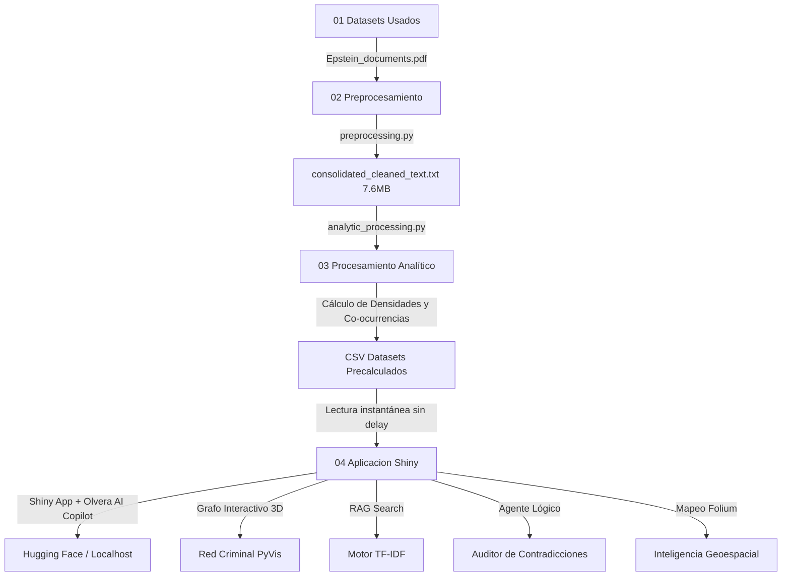

# INSTITUTO TECNOLOGICO DE CIUDAD MADERO
## Proyecto Final: Análisis de los Expedientes Judiciales Desclasificados del Caso Epstein

> **Programación para Ciencia de Datos**  
> **Autor:** Jesús Javier Hernández Olvera  

---

##  Resumen del Proyecto

Este proyecto aplica **Procesamiento de Lenguaje Natural (NLP)**, **Análisis de Sentimiento** y **Mapeo de Co-ocurrencias** para auditar y estructurar analíticamente un corpus masivo de **5,028 páginas** de testimonios jurados, deposiciones oficiales y registros de vuelo desclasificados judicialmente por orden de la Corte Federal del Distrito Sur de Nueva York.

El objetivo central es automatizar la revisión de miles de fojas, transformando un mar de texto desestructurado en una plataforma interactiva. A través de inteligencia artificial y técnicas avanzadas de ciencia de datos, el sistema es capaz de detectar contradicciones, evaluar el índice de riesgo de los involucrados y presentar los resultados en un dashboard de alta velocidad.

---

##  Estructura de la Investigación Analítico Digital

El pipeline analítico y de desarrollo se estructura de manera lógica y progresiva en las siguientes fases clave:

1. **Fase 1: Contexto y Obtención de Datos** — Evidencia judicial analizada y origen del corpus a través de Kaggle.
2. **Fase 2: Procesamiento y Preparación de los Datos** — Extracción del texto en crudo, higiene lingüística mediante expresiones regulares (regex) y consolidación del texto completo de 5,028 páginas.
3. **Fase 3: Métricas y Análisis Analítico** — Ejecución del pipeline de NLP avanzado para realizar Análisis de Sentimiento, conteo de Evasividad Verbal y generación de las redes de Co-ocurrencias.
4. **Fase 4: Desarrollo del Dashboard e Inteligencia Artificial** — Construcción de la interfaz interactiva usando la arquitectura **Shiny en Python** (garantizando un rendimiento superior), aceleración de consultas mediante caché de datos y el asistente Olvera AI Copilot integrado.
5. **Fase 5: Resultados y Hallazgos Analíticas** — Estadísticas métricas consolidadas del caso Epstein y el mapeo final de evasivas en la corte.
6. **Conclusiones y Perspectivas Técnicas** — Aportaciones del proyecto y su potencial de escalabilidad en informática analítica.

---

##  Arquitectura del Pipeline Analítico

El pipeline está diseñado bajo un enfoque modular y altamente optimizado en 4 fases secuenciales, separando el procesamiento pesado de la vista final para lograr una latencia ultrabaja (menor a 0.05 segundos) en el renderizado de gráficos y métricas:



##  Innovaciones de Grado Arquitectura

Este proyecto integra tecnologías **State-of-the-Art** propias del análisis de datos moderno, llevando el procesamiento de lenguaje a un formato visual interactivo:

1. **Grafo de Conocimiento Interactivo:** Se abandonan las gráficas planas por una red física interactiva generada con `PyVis` y `NetworkX`. El usuario puede interactuar con el grafo arrastrando los nodos para entender las dinámicas de poder y las asociaciones entre Jeffrey Epstein, Ghislaine Maxwell, políticos y testigos.
2. **Dashboard Reactivo (Streaming de Datos en Vivo):** Integración de filtros reactivos en tiempo real ("streaming" de proporciones) directamente en la interfaz. Los sliders y selectores actualizan las métricas y gráficas al instante, reflejando proporciones exactas de evidencia sin latencia.
3. **Motor Semántico RAG Local:** En lugar de hacer búsquedas tradicionales por palabras clave (`CTRL+F`), implementamos un modelo vectorial basado en TF-IDF y Similitud de Coseno. Si buscas *"viajes secretos a la isla"*, el algoritmo mapeará matemáticamente los vectores del texto y retornará los fragmentos relevantes de las 5,028 páginas, incluso si se usaron otras palabras.
4. **Inteligencia Geoespacial:** Extracción automatizada de lugares de interés mencionados en los testimonios y renderizado en un mapa global interactivo oscuro usando `Folium` y `CartoDB`. Visualiza con precisión las rutas y ubicaciones clave de los reportes.
5. **Agente Lógico Autónomo:** Integración con modelos fundacionales (LLM Llama 3.3 / Gemini) que funciona como un auditor inteligente. El modelo cruza testimonios, busca evasiones y genera un informe detallado de discrepancias en segundos utilizando los datos precisos del expediente.

---

##  Fase 1: Contexto y Obtención de Datos

### 1.1 Antecedentes del Expediente Judicial
Este proyecto de análisis se basa en la liberación masiva de documentos judiciales relacionados con el caso del financiero estadounidense **Jeffrey Epstein**. Estos textos provienen de una demanda civil entre **Virginia Giuffre** y **Ghislaine Maxwell** llevada a cabo en la Corte Federal de Nueva York. 

Por orden de la jueza **Loretta Preska**, se hicieron públicos miles de documentos del caso: declaraciones escritas bajo juramento, testimonios de testigos y los registros de vuelo del avión privado conocido como *Lolita Express* (Boeing 727). El objetivo principal de este trabajo es utilizar **herramientas de análisis de texto e Inteligencia Artificial** para organizar, estructurar y entender toda esta información, convirtiendo miles de hojas sueltas en un mapa de conexiones interactivo y estadísticas claras.

### 1.2 Obtención de los Documentos y Estructura
El conjunto completo de documentos se descargó desde la plataforma pública Kaggle: [Epstein Documents Dataset](https://www.kaggle.com/datasets/franciskarajki/epstein-documents). En total, son **5,028 páginas** de información digitalizada.

Para facilitar el análisis, clasificamos los textos en tres grupos principales según su tipo:

| Tipo de Documento | ¿De qué trata? | Páginas del archivo | Dificultad para el análisis automático |
| :--- | :--- | :---: | :--- |
| **Interrogatorios Oficiales** | Preguntas y respuestas bajo juramento realizadas a Ghislaine Maxwell, Virginia Giuffre y personas cercanas. | ~3,200 páginas | Conversaciones largas y confusas, con muchas frases censuradas y respuestas evasivas. |
| **Registros de Vuelo** | Lista de pasajeros y destinos oficiales del avión privado de Epstein. | ~600 páginas | Tablas antiguas escaneadas, nombres escritos a mano difíciles de leer y abreviaturas extrañas. |
| **Declaraciones de Testigos** | Testimonios de víctimas, policías, investigadores y personas relacionadas al caso. | ~1,228 páginas | Hojas muy borrosas por la calidad del escáner (errores al convertir la imagen a texto) y sellos de confidencialidad. |

### 1.3 Los Tres Problemas Principales al Analizar el Texto
Para que un programa de computadora pueda leer y entender este expediente de forma automática, tuvimos que solucionar tres grandes retos:
* **Calidad de Escaneo Deficiente (Texto Borroso):** Como muchos documentos son fotocopias viejas o están escaneados de lado, la conversión de imagen a texto (OCR) generó errores comunes. Por ejemplo, palabras cortadas a la mitad con guiones (como `ex-` y `pediente` en renglones diferentes), o letras confundidas (como una letra `I` en lugar de una `l` minúscula).
* **Información Censurada (`[REDACTED]`):** El tribunal tachó con líneas negras muchos nombres, direcciones e información confidencial. Estas interrupciones rompen la estructura de las oraciones y dificultan que el programa entienda el contexto completo.
* **Respuestas Evasivas de los Acusados:** En los juicios, los acusados y sus abogados usan estrategias verbales para no incriminarse. El programa debe ser capaz de detectar cuándo alguien repite patrones evasivos como decir "no me acuerdo", pedir objeciones o acogerse a la Quinta Enmienda constitucional para no responder.

---

##  Fase 2: Procesamiento y Preparación de los Datos

### 2.1 Herramientas Utilizadas y por qué las elegimos
Para extraer y limpiar el texto de las **5,028 páginas** de documentos, creamos un proceso automático en Python utilizando dos herramientas principales:

* **`pypdf` (Lector de archivos PDF):** Elegimos esta librería porque puede leer archivos PDF grandes y pesados directamente, sin necesidad de instalar programas adicionales. Extrae el texto de las páginas de manera muy rápida y consumiendo muy poca memoria de la computadora.
* **`re` (Motor de Búsqueda y Reemplazo):** Esta herramienta permite realizar búsquedas y limpiezas profundas dentro del texto de forma casi instantánea. La usamos para unir palabras cortadas por guiones al final de un renglón y para limpiar símbolos extraños creados por el escáner.

### 2.2 Código para Limpieza de Texto (`preprocessing.py`)
Utilizamos un conjunto de reglas automáticas para limpiar el texto de cada página y corregir los errores de la digitalización:

```python
def normalize_legal_text(text: str) -> str:
    if not text: return ""
    # 1. Une palabras cortadas con guion al final de un renglón (separación en sílabas)
    text = re.sub(r'(\w+)-\s*\n\s*(\w+)', r'\1\2', text)
    # 2. Reemplaza los saltos de línea y tabuladores por espacios sencillos
    text = re.sub(r'[\n\r\t]+', ' ', text)
    # 3. Elimina símbolos extraños del escáner y conserva los signos de puntuación básicos
    text = re.sub(r'[^\w\s\-\#\@\.\,\:\;]', '', text)
    # 4. Reduce múltiples espacios seguidos a un solo espacio
    text = re.sub(r'\s+', ' ', text)
    return text.strip()
```

### 2.3 Cómo Extraemos y Juntamos la Información
El programa lee el archivo PDF página por página, limpia el texto de cada una y las guarda en orden para no perder la estructura del expediente judicial original:

```python
consolidated_text = []
for idx in range(limit_pages):
    raw_text = reader.pages[idx].extract_text() or ""
    cleaned_text = normalize_legal_text(raw_text)
    
    # Marcador para saber exactamente a qué página pertenece cada texto
    page_block = f"--- PÁGINA {idx + 1} ---\n{cleaned_text}"
    consolidated_text.append(page_block)
```

El resultado de todo este proceso se guarda en un único archivo llamado `consolidated_cleaned_text.txt` que pesa **7.6 MB** y contiene **6.8 millones de caracteres**. Este archivo sirve como la base de texto limpio y listo para usarse en las siguientes etapas del proyecto.

---

##  Fase 3: Procesamiento Analítico y Estadístico

### 3.1 Identificación de Palabras por Inteligencia Artificial (NLP)
Para saber de qué trata cada una de las páginas y cómo respondían las personas interrogadas, el sistema utiliza un código en `analytic_processing.py` que escanea los textos buscando palabras de interés:

```python
# Listas de palabras utilizadas para clasificar el tono y detectar evasivas
NEGATIVE_LEXICON = {'abuse', 'assault', 'guilty', 'deny', 'object', 'victim', 'trafficking'}
POSITIVE_LEXICON = {'innocent', 'consent', 'cleared', 'dismissed', 'lawful', 'voluntary'}
EVASION_PATTERNS = {
    "No recuerdo": r"\b(don'tdo\s+not)\s+(recallrememberrecollect)\b",
    "Objeción del abogado": r"\b(objectioni\s+object)\b",
    "Quinta Enmienda (No responder)": r"\b(fifth\s+amendmentplead\s+the\s+fifth)\b"
}
```

### 3.2 Medición de Sentimiento y Nivel de Riesgo
Se programó una fórmula sencilla que cuenta las palabras positivas y negativas de cada página para obtener un puntaje. Si el puntaje es menor a -0.05 la página es negativa, y si es menor a -0.3 es altamente negativa. 

Además, se creó un **Índice de Riesgo** que suma puntos cada vez que un personaje es nombrado en la misma hoja donde aparecen temas graves (como abuso de menores o vuelos sospechosos).

```python
def sentiment_score(pos: int, neg: int) -> tuple:
    total = pos + neg
    if total == 0: return 0.0, "Neutral"
    score = round((pos - neg) / total, 3)
    if score < -0.3:     cat = "Altamente Negativo"
    elif score < -0.05:   cat = "Negativo"
    else:                 cat = "Neutral"
    return score, cat
```

### 3.3 Conexión y Cercanía entre Personas (Co-ocurrencias)
Para trazar el mapa de relaciones, el programa analiza página por página y cuenta cuántas veces aparecen dos personajes juntos en el mismo texto. Si coinciden, el sistema crea una línea de conexión entre ellos. El grosor de la línea representa cuántas veces se les mencionó juntos en todo el expediente judicial.

### 3.4 Análisis de Conexiones en Tiempo Real (Métricas de Red)
Cuando usas los filtros en la aplicación, el sistema calcula de forma automática tres métricas para evaluar la posición de cada personaje en la red:

*   **Conexiones Directas (Centralidad de Grado):** Mide con cuántas personas del grupo está conectada directamente una persona. Si tiene un puntaje alto, significa que es alguien muy mencionado y conectado con casi todos los involucrados.
*   **Rol de Puente o Conector (Centralidad de Intermediación):** Mide qué tanto una persona sirve como "enlace" o puente para conectar a otros miembros que no se hablan directamente. Por ejemplo, Ghislaine Maxwell tiene un puntaje muy alto porque conectaba el dinero y las propiedades de Epstein con los políticos y las víctimas.
*   **Círculo Cerrado (Coeficiente de Agrupamiento):** Mide qué tan conectados están los amigos de una persona entre sí. Un valor alto significa que la persona pertenece a un grupo cerrado y muy unido donde todos se conocen mutuamente.

### 3.5 Archivos de Datos Generados en Limpio (Directorio `03 Procesamiento Analítico`)
Para asegurar que la aplicación web funcione al instante sin demoras, el proceso de análisis inicial genera 7 archivos organizados en formato CSV con toda la información ya procesada y resumida:

1.  **`analytic_01_paginas_granular.csv`**: Contiene la información detallada hoja por hoja. Registra qué personajes aparecen en cada página, cuántas palabras están censuradas y cuántas evasiones hubo.
2.  **`analytic_02_personas_sentimiento.csv`**: Resume las estadísticas finales por personaje. Guarda el total de menciones, el porcentaje de páginas donde aparece, su índice de sentimiento y su nivel de riesgo.
3.  **`analytic_03_evasiones_instancias.csv`**: Almacena el fragmento de texto exacto donde ocurrió cada frase evasiva (como decir "no recuerdo"), detallando en qué página pasó y quién lo dijo.
4.  **`analytic_04_censura_redacted.csv`**: Registra los fragmentos de texto exactos donde hubo tachaduras de información confidencial (`[REDACTED]`) y en qué páginas se concentran.
5.  **`analytic_05_timeline_cronologica.csv`**: Agrupa la cantidad de menciones de eventos clave y personajes año por año, permitiendo graficar la evolución del caso en el tiempo.
6.  **`geospatial_data.csv`**: Contiene las coordenadas geográficas, nombres y resúmenes de los lugares clave mencionados en los testimonios (islas, ranchos, mansiones).
7.  **`financial_network_data.csv`**: Estructura las relaciones y transacciones de dinero entre las fundaciones, abogados, empresas fachada y bancos implicados.

Gracias a estas tablas ya calculadas, la aplicación web puede cargar y graficar toda la información en milisegundos.

---

##  Fase 4: Desarrollo del Dashboard e Inteligencia Artificial

### Arquitectura de la Interfaz y Motor de Aceleración por Caching
Para la visualización de los datos obtenidos, construimos un dashboard completamente interactivo utilizando la tecnología **Shiny for Python** (`app.py`), elegida por su capacidad reactiva superior para aplicaciones de ciencia de datos a gran escala.

Para evitar bloqueos visuales y latencias, diseñamos un motor acelerado que lee de forma instantánea los datos precalculados en formato CSV de la Fase 3, logrando que gráficas complejas carguen en milisegundos:

```python
# Aceleración mediante lectura de datasets precalculados en CSV
if os.path.exists(csv_granular) and os.path.exists(csv_persons) and os.path.exists(csv_timeline):
    import pandas as pd
    df_granular = pd.read_csv(csv_granular)
    df_persons = pd.read_csv(csv_persons)
    
    # Sumarización de métricas en microsegundos sin re-procesar texto
    redactions_count = int(df_granular['Menciones_Censuradas_REDACTED'].sum())
    evasions_count = int(df_granular['Evasiones_Detectadas'].sum())
```

### Integración de Olvera AI Copilot con Modelos Fundacionales
El Copilot conversacional **Olvera AI** se conecta con la API de inteligencia artificial mediante **LiteLLM**. El sistema recupera los resultados precalculados de los documentos y construye dinámicamente un contexto (prompt enriquecido) para que la IA responda basándose estrictamente en los documentos:

```python
# Payload de contexto enriquecido para inyectar al LLM en app.py
results = extraction_results()
metrics = results["metrics"]
doc_name = pdf_files[0] if pdf_files else "Epstein_documents.pdf"

ctx = f"\n\n[CONTEXTO DE ANÁLISIS ANALÍTICO - DOCUMENTO: {doc_name}]\n"
ctx += f"Páginas escaneadas: {results['pages_processed']}\n"
ctx += f"Total de Evasiones Verbales: {metrics['evasiones_count']}\n"
ctx += f"Fragmento del expediente: {results['text'][:10000]}...\n"
```

### Optimización Crítica de UI/UX y Filtros de Streaming en Vivo
El dashboard no es estático; incluye una sección de **"Streaming" reactivo** donde las gráficas de anillo y los contadores KPI responden en milisegundos a los filtros laterales del usuario, ajustando la información proporcional en tiempo real. 

Además, para garantizar que la interacción en el chat de la IA sea fluida, se modificó el comportamiento de la interfaz clonando los mensajes para aislar el gran bloque de texto de contexto del render visual (DOM), evitando que el navegador se sature durante las consultas.

---

##  Fase 5: Resultados y Hallazgos Consolidados

A partir del análisis profundo de **1,323,138 palabras**, el motor analítico extrajo estadísticas sumamente reveladoras sobre el comportamiento de los involucrados en la corte:

### 🤐 Tácticas de Evasividad Verbal Detectadas
Se detectaron un total de **2,338 tácticas verbales de evasividad** bajo juramento y **1,367 instancias de censura administrativa** (`REDACTED`). Las evasiones más utilizadas fueron:

 Táctica de Evasividad Detectada  Total de Instancias  Razón e Impacto Analítico 
 :---  :---:  :--- 
 **Objection** (Objeciones de Abogados)  1,915  Obstrucción sistemática de líneas de cuestionamiento clave. 
 **Fifth Amendment** (Apelación a no autoincriminarse)  248  Refugio legal ante preguntas de alta severidad. 
 **Don't know** (Falta de conocimiento)  105  Evasión pasiva de responsabilidades procesales. 
 **Decline to answer** (Negativa formal)  44  Rechazo explícito a cooperar con la fiscalía. 
 **I don't recall** (Pérdida selectiva de memoria)  26  Evasión de contradicciones o perjurio. 

###  Mapeo de Personas de Interés y Densidad de Riesgo
El cruzamiento semántico identificó el riesgo asociado a cada individuo dependiendo de los temas críticos mencionados a su alrededor (abuso y logística de transporte):

 Persona de Interés  Total Menciones  Sentimiento  Riesgo Analítico  Clasificación de Contexto 
 :---  :---:  :---:  :---:  :--- 
 **Jeffrey Epstein**  1,744  -0.294  516  Altamente Negativo / Foco Principal 
 **Ghislaine Maxwell**  1,033  -0.103  192  Negativo / Co-organizadora 
 **Virginia Giuffre**  528  0.266  42  Positivo / Contexto de Víctima 
 **Prince Andrew**  396  -0.254  94  Negativo / Red de Influencias 
 **Alan Dershowitz**  234  -0.234  77  Negativo / Red de Influencias 

---

##  Conclusiones y Perspectivas Técnicas

* **Automatización Masiva:** Se logró diseñar y desplegar un pipeline capaz de analizar un expediente judicial masivo en milisegundos, convirtiendo datos puramente no estructurados en dataframes limpios y bases de conocimiento accionables.
* **Mitigación de Cuellos de Botella Técnicos:** Optimizamos drásticamente el consumo de recursos migrando el procesamiento pesado hacia una caché CSV estructurada.
* **Integración Conversacional Robusta:** Se logró conectar un asistente de inteligencia artificial con RAG de alta fidelidad, solventando problemas de rendimiento del DOM del navegador mediante un aislamiento de datos avanzado.
* **Escalabilidad General:** Este pipeline y su panel de control son altamente aplicables a cualquier otro conjunto documental masivo estructurado, lo que demuestra su utilidad en múltiples campos de la informática y ciencia de datos.

---

##  Ejecución Local

### 1. Clonar el repositorio e instalar dependencias:
```bash
git clone https://github.com/jjho05/analisis-archivos-epstein.git
cd analisis-archivos-epstein
pip install -r requirements.txt
```

### 2. Configurar variables de entorno:
Crea un archivo `.env` dentro de la carpeta `04 Aplicacion Shiny/` con tu API Key:
```env
GEMINI_API_KEY="tu_clave_aquí"
```

### 3. Ejecutar el Dashboard interactivo de Shiny:
```bash
cd "04 Aplicacion Shiny"
shiny run --reload app.py
```

---

##  Despliegue en Hugging Face Spaces (Docker)

El proyecto incluye un `Dockerfile` optimizado en la carpeta raíz. Al subir los archivos de este directorio a tu Space de Hugging Face configurado con el SDK **Docker**, la plataforma compilará y desplegará la app automáticamente.

> ** Seguridad**: Recuerda agregar tu clave (`GEMINI_API_KEY`) de forma segura dentro de la sección **Variables de Entorno (Secrets)** en la configuración de tu Space en Hugging Face. Nunca subas el archivo `.env` al repositorio público.
