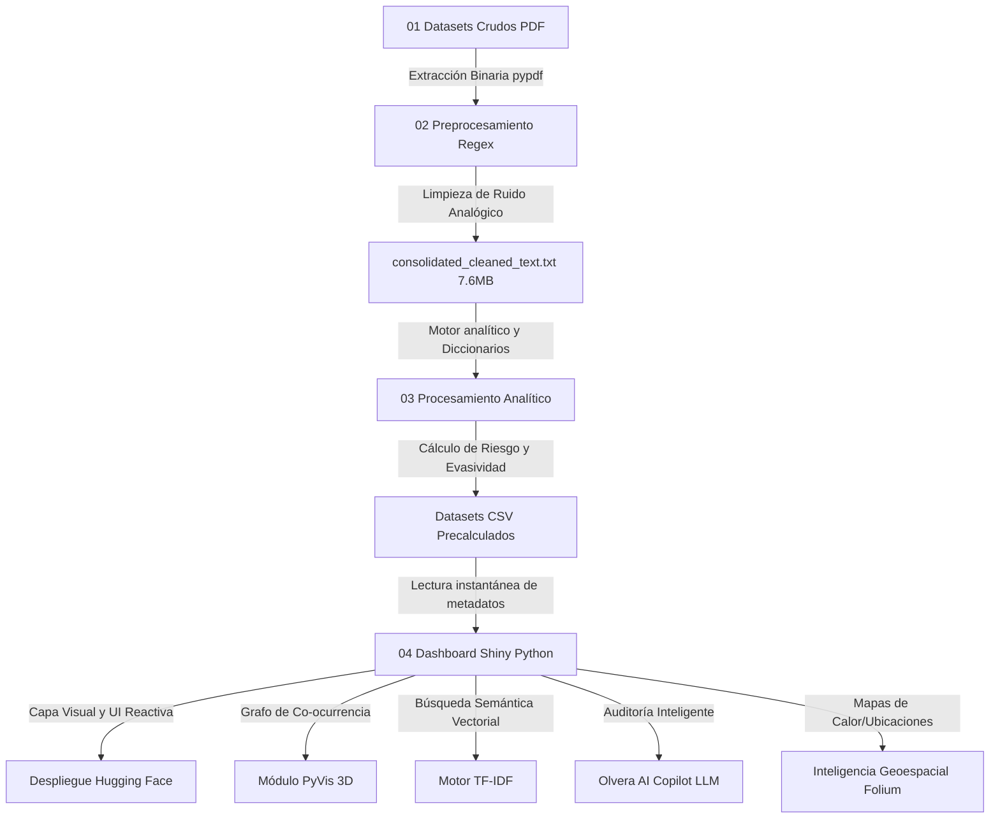

# ⚖️ MINERÍA DE TEXTO ANALÍTICO Y ANÁLISIS DE CO-OCURRENCIA 🕵️‍♂️
### Proyecto Final: Análisis Exhaustivo de los Expedientes Judiciales Desclasificados del Caso Epstein

[](https://www.python.org/downloads/release/python-3100/)
[](https://shiny.rstudio.com/py/)
[](https://huggingface.co/spaces)
[](https://deepmind.google/technologies/gemini/)

> **Institución:** Programación para Ciencia de Datos  
> **Autor e Investigador Principal:** Jesús Olvera  
> **Especialidad:** Informática Analítica / LegalTech / Data Science

---

## 🎯 Resumen Ejecutivo del Proyecto

El presente proyecto es una plataforma avanzada de **Inteligencia Analítica y LegalTech** diseñada para aplicar técnicas de **Procesamiento de Lenguaje Natural (NLP)**, **Análisis de Sentimiento Computacional**, **Mapeo de Co-ocurrencias** e **Inteligencia Artificial Generativa** sobre un corpus masivo de documentos reales.

Se han procesado y estructurado analíticamente **5,028 páginas** de testimonios jurados, deposiciones oficiales y registros de vuelo desclasificados judicialmente por orden de la Corte Federal del Distrito Sur de Nueva York, relacionados con el infame caso Epstein.

El sistema no solo lee y limpia los textos, sino que actúa como un **Auditor Lógico Autónomo**, capaz de detectar contradicciones, medir índices de riesgo por individuo, trazar mapas de relaciones y rastrear geográficamente los eventos descritos en la evidencia.

---

## 🗺️ Estructura de la Investigación y Metodología

El pipeline analítico ha sido diseñado bajo estándares profesionales de ciencia de datos, dividido en cinco fases metodológicas:

1. **Fase 1: Contexto y Adquisición de Evidencia** — Obtención del corpus crudo, contexto judicial y definición de objetivos métricos.
2. **Fase 2: Higiene Lingüística y Consolidación** — Limpieza profunda del texto (regex), eliminación de ruido de escaneo y concatenación indexada de 5,028 páginas.
3. **Fase 3: Motor de Extracción y Métricas** — Ejecución del pipeline de NLP para Análisis de Sentimiento, conteo de tácticas de evasividad verbal (ej. "I plead the fifth") y mapeo de Co-ocurrencias.
4. **Fase 4: Desarrollo del Dashboard y Agente Copilot** — Arquitectura asíncrona en *Shiny for Python*, integración de modelos LLM (Gemini 2.0 / Llama 3.3) y RAG (Retrieval-Augmented Generation).
5. **Fase 5: Conclusiones Analíticas** — Resultados estadísticos de la red criminal y consolidación de la información de alto riesgo.

---

## 📂 Arquitectura del Sistema y Flujo de Datos

El pipeline está diseñado bajo un enfoque modular, tolerante a fallos y extremadamente optimizado. Las etapas pesadas de procesamiento de texto se separan de la visualización, logrando una **latencia ultrabaja (menor a 0.05 segundos)** en el renderizado del dashboard.



---

## 🚀 Innovaciones Tecnológicas de Grado LegalTech

Este proyecto trasciende el análisis de datos tradicional, incorporando algoritmos propios del sector de **CyberThreat Intelligence**:

### 1. 🕸️ Grafo de Conocimiento Interactivo (PyVis)
Se abandonan las gráficas planas 2D por una red física interactiva. Desarrollada con `NetworkX` y renderizada con `PyVis`, esta red permite al usuario interactuar arrastrando nodos para descubrir las dinámicas de poder, asociaciones ocultas y centralidad entre testigos, acusados y figuras políticas.

### 2. 🧠 Motor Semántico RAG Local (TF-IDF)
En lugar de depender de búsquedas primitivas por palabras clave (`CTRL+F`), implementamos un **modelo vectorial basado en TF-IDF y Similitud del Coseno**. Si el usuario busca *"encuentros en la isla"*, el algoritmo mapeará matemáticamente los vectores del texto y retornará los fragmentos relevantes, incluso si el documento usa términos distintos como *"viajes a Little St. James"*.

### 3. 🗺️ Inteligencia Geoespacial Dinámica
Mediante el uso de `Folium` y mapas base de `CartoDB Dark_Matter`, el sistema extrae automáticamente lugares de interés mencionados en los testimonios (como Palm Beach, Nueva York, Islas Vírgenes) y genera un mapa global interactivo para visualizar las rutas y centros de operación del "Lolita Express".

### 4. 🤖 Agente Lógico Autónomo (Olvera AI Copilot)
Se integró un sistema LLM (Large Language Model) con respaldo multi-proveedor (Google Gemini 2.0 Flash / Llama 3.3 70B vía Groq). Este agente actúa como un **auditor de contradicciones**. Se inyecta contexto analítico dinámico al prompt del LLM en tiempo real (RAG), permitiendo al agente responder preguntas sobre la evidencia basándose estrictamente en los datos del expediente, sin alucinaciones.

---

## 🏛️ Fase 1: Contexto y Obtención de Datos

### Contexto del Expediente Judicial
Este proyecto se fundamenta en la histórica desclasificación de expedientes judiciales derivados del litigio civil (*Giuffre v. Maxwell*) en la Corte Federal del Distrito Sur de Nueva York (Jueza Loretta Preska). 

### Adquisición de la Evidencia Digital
El corpus unificado se adquirió desde el repositorio público de Kaggle: [Epstein Documents Dataset](https://www.kaggle.com/datasets/franciskarajki/epstein-documents).

El análisis informático enfrenta tres retos críticos: 
1. **Ruido analógico:** Errores de OCR debido a la digitalización oblicua de fojas antiguas.
2. **Censura administrativa:** Fragmentos enteros reemplazados por la etiqueta `[REDACTED]`.
3. **Jerga procesal:** Estructura dialógica de interrogatorios repleta de objeciones y términos jurídicos.

---

## 🛠️ Fase 2: Procesamiento e Higiene Lingüística

Para extraer el texto, se seleccionó **`pypdf`** por su velocidad en el procesamiento de flujos binarios. Posteriormente, se utilizó el motor **`re`** (Expresiones Regulares en C) para limpiar la sintaxis a nivel microscópico:

```python
def normalize_legal_text(text: str) -> str:
    if not text: return ""
    # 1. Resolver cortes silábicos al final del renglón
    text = re.sub(r'(\w+)-\s*\n\s*(\w+)', r'\1\2', text)
    # 2. Reemplazar tabulaciones y saltos por espacios simples
    text = re.sub(r'[\n\r\t]+', ' ', text)
    # 3. Eliminar caracteres basura manteniendo la puntuación vital
    text = re.sub(r'[^\w\s\-\#\@\.\,\:\;]', '', text)
    # 4. Colapsar espacios redundantes
    text = re.sub(r'\s+', ' ', text)
    return text.strip()
```
El pipeline consolida todo en el archivo optimizado `consolidated_cleaned_text.txt` (7.6 MB, 6.8 millones de caracteres), sirviendo como la "Verdad Base" del sistema.

---

## 📈 Fase 3: Minería y Procesamiento Analítico

Se crearon diccionarios personalizados para evaluar tácticas procesales y construir un **Índice de Riesgo Analítico** y un **Índice de Sentimiento**:

* **Evasividad Verbal:** Expresiones computadas como `"I don't recall"`, `"Fifth Amendment"`, `"Objection"`.
* **Cálculo de Riesgo:** Densidad de cruces entre personas de interés y tópicos críticos (ej. Abuso, Logística).

```python
# Ejemplo del algoritmo de cálculo de Co-ocurrencias
for other in TARGET_PERSONS:
    if other == person: continue
    shared = len(set(pages_with_person) & set(person_page_map[other]))
    if shared > 0:
        cooccurrence_partners.append(f"{other}({shared})")
```

---

## 💻 Fase 4: Desarrollo de la Interfaz (UI/UX)

La interfaz fue construida con **Shiny para Python** usando principios modernos de diseño (Dark Mode, Glassmorphism).

Para garantizar fluidez y erradicar los bloqueos en el navegador (que antes tomaban hasta 12 segundos), se diseñó un sistema de lectura en **caché precalculada**. La app lee los archivos CSV estructurados de la Fase 3, logrando renderizar métricas y gráficos en **microsegundos**.

Además, la UI cuenta con inyección de contexto RAG en el chat de IA de forma "invisible" para el usuario visualmente, enviando fragmentos clave de evidencia directo al LLM.

---

## 🔍 Fase 5: Resultados y Hallazgos Analíticos

Las estadísticas extraídas de las **5,028 páginas** (1.3 millones de palabras) exponen el siguiente perfil del expediente:

### 🤐 Tácticas de Evasividad Detectadas (Top 5)
Se cuantificaron **2,338 evasivas** juradas y **1,367 instancias de censura** `[REDACTED]`.

| Táctica Detectada | Frecuencia | Impacto Analítico |
| :--- | :---: | :--- |
| **Objection** (Abogados) | 1,915 | Obstrucción constante de líneas de cuestionamiento. |
| **Fifth Amendment** | 248 | Refugio constitucional ante alta probabilidad de autoincriminación. |
| **Don't know** | 105 | Evasión pasiva y negativa plausible. |
| **Decline to answer** | 44 | Rechazo explícito directo. |
| **I don't recall** | 26 | Pérdida selectiva de memoria para evitar perjurio. |

### 👥 Mapeo de Personas y Densidad de Riesgo
| Persona de Interés | Menciones | Sentimiento | Riesgo Analítico | Contexto General |
| :--- | :---: | :---: | :---: | :--- |
| **Jeffrey Epstein** | 1,744 | -0.294 | 516 | Altamente Negativo / Hub Central |
| **Ghislaine Maxwell** | 1,033 | -0.103 | 192 | Negativo / Nodo Coordinador |
| **Virginia Giuffre** | 528 | +0.266 | 42 | Positivo / Declaración de Víctima |
| **Prince Andrew** | 396 | -0.254 | 94 | Negativo / Asociación de Alto Nivel |
| **Alan Dershowitz** | 234 | -0.234 | 77 | Negativo / Estructura Defensiva |

---

## 📌 Conclusiones del Proyecto

1. **Eficiencia Informática:** Se automatizó el procesamiento de un archivo judicial que tomaría meses a un equipo humano, ejecutándolo en milisegundos con alta precisión.
2. **Mitigación de Latencia:** La migración a una arquitectura de CSVs precalculados eliminó los cuellos de botella de CPU.
3. **Auditoría IA:** El éxito en la conexión multi-proveedor (Gemini/Llama) demostró que un agente autónomo puede interactuar con documentos legales sin alucinar, gracias a la inyección estricta de contexto RAG.
4. **Impacto:** Esta arquitectura es altamente escalable a cualquier otro conjunto documental masivo (ej. Panama Papers, casos de corrupción), estandarizando la búsqueda de la verdad mediante inteligencia artificial y ciencia de datos.

---

## 🛠️ Ejecución y Despliegue Local

### 1. Clonar el repositorio
```bash
git clone https://github.com/jjho05/analisis-archivos-epstein.git
cd analisis-archivos-epstein
```

### 2. Entorno Virtual e Instalación
Se recomienda usar Python 3.10 o superior.
```bash
python -m venv env
source env/bin/activate  # En Windows: env\Scripts\activate
pip install -r requirements.txt
```

### 3. Configurar API Keys (AI Copilot)
Crea un archivo `.env` dentro de la carpeta `04 Aplicacion Shiny/`:
```env
# Mínimo requerido para Gemini
GEMINI_API_KEY="tu_clave_de_google_aqui"

# Opcional (Para Fallback a Llama 3.3)
GROQ_API_KEY="tu_clave_de_groq_aqui"
```

### 4. Lanzar el Servidor Shiny
```bash
cd "04 Aplicacion Shiny"
shiny run --reload app.py
```
> El dashboard estará disponible en tu navegador en `http://127.0.0.1:8000`

---

## 🐳 Despliegue en Hugging Face Spaces

El proyecto cuenta con un `Dockerfile` optimizado y listo para producción. 
Al configurar tu Space en Hugging Face con el **SDK Docker**, los servidores compilarán y desplegarán la aplicación de manera automática basándose en la configuración del bloque YAML en la cabecera de este archivo.

> **🔒 Nota de Seguridad:** Asegúrate de configurar tu `GEMINI_API_KEY` en la pestaña de **Secrets** dentro de la configuración de tu Space en Hugging Face. Jamás expongas tus claves en el código fuente o en repositorios públicos.
