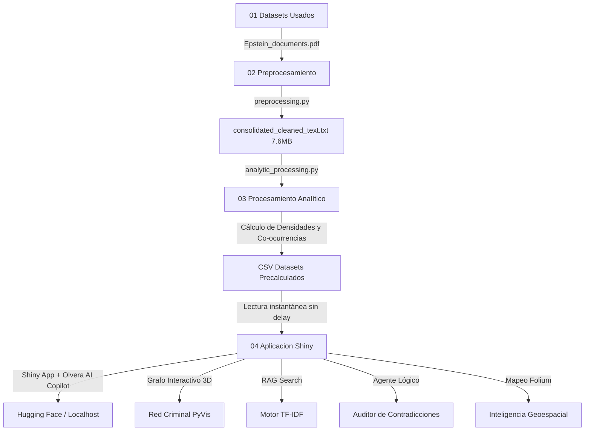

# MINERÍA DE TEXTO ANALÍTICO Y ANÁLISIS DE CO-OCURRENCIA ⚖️🕵️‍♂️
## Proyecto Final: Análisis de los Expedientes Judiciales Desclasificados del Caso Epstein

> **Programación para Ciencia de Datos**  
> **Autor:** Jesús Olvera  

---

## 🎯 Resumen del Proyecto

Este proyecto aplica **Procesamiento de Lenguaje Natural (NLP)**, **Análisis de Sentimiento** y **Mapeo de Co-ocurrencias** para auditar y estructurar analíticamente un corpus masivo de **5,028 páginas** de testimonios jurados, deposiciones oficiales y registros de vuelo desclasificados judicialmente por orden de la Corte Federal del Distrito Sur de Nueva York.

El objetivo central es automatizar la revisión de miles de fojas, transformando un mar de texto desestructurado en una plataforma interactiva. A través de inteligencia artificial y técnicas avanzadas de ciencia de datos, el sistema es capaz de detectar contradicciones, evaluar el índice de riesgo de los involucrados y presentar los resultados en un dashboard de alta velocidad.

---

## 🗺️ Estructura de la Investigación Analítico Digital

El pipeline analítico y de desarrollo se estructura de manera lógica y progresiva en las siguientes fases clave:

1. **Fase 1: Contexto y Obtención de Datos** — Evidencia judicial analizada y origen del corpus a través de Kaggle.
2. **Fase 2: Procesamiento y Preparación de los Datos** — Extracción del texto en crudo, higiene lingüística mediante expresiones regulares (regex) y consolidación del texto completo de 5,028 páginas.
3. **Fase 3: Métricas y Análisis Analítico** — Ejecución del pipeline de NLP avanzado para realizar Análisis de Sentimiento, conteo de Evasividad Verbal y generación de las redes de Co-ocurrencias.
4. **Fase 4: Desarrollo del Dashboard e Inteligencia Artificial** — Construcción de la interfaz interactiva usando la arquitectura **Shiny en Python** (garantizando un rendimiento superior), aceleración de consultas mediante caché de datos y el asistente Olvera AI Copilot integrado.
5. **Fase 5: Resultados y Hallazgos Analíticas** — Estadísticas métricas consolidadas del caso Epstein y el mapeo final de evasivas en la corte.
6. **Conclusiones y Perspectivas Técnicas** — Aportaciones del proyecto y su potencial de escalabilidad en informática analítica.

---

## 📂 Arquitectura del Pipeline Analítico

El pipeline está diseñado bajo un enfoque modular y altamente optimizado en 4 fases secuenciales, separando el procesamiento pesado de la vista final para lograr una latencia ultrabaja (menor a 0.05 segundos) en el renderizado de gráficos y métricas:



## 🚀 Innovaciones de Grado Arquitectura

Este proyecto integra tecnologías **State-of-the-Art** propias del análisis de datos moderno, llevando el procesamiento de lenguaje a un formato visual interactivo:

1. **Grafo de Conocimiento Interactivo:** Se abandonan las gráficas planas por una red física interactiva generada con `PyVis` y `NetworkX`. El usuario puede interactuar con el grafo arrastrando los nodos para entender las dinámicas de poder y las asociaciones entre Jeffrey Epstein, Ghislaine Maxwell, políticos y testigos.
2. **Motor Semántico RAG Local:** En lugar de hacer búsquedas tradicionales por palabras clave (`CTRL+F`), implementamos un modelo vectorial basado en TF-IDF y Similitud de Coseno. Si buscas *"viajes secretos a la isla"*, el algoritmo mapeará matemáticamente los vectores del texto y retornará los fragmentos relevantes de las 5,028 páginas, incluso si se usaron otras palabras.
3. **Inteligencia Geoespacial:** Extracción automatizada de lugares de interés mencionados en los testimonios y renderizado en un mapa global interactivo oscuro usando `Folium` y `CartoDB`. Visualiza con precisión las rutas y ubicaciones clave de los reportes.
4. **Agente Lógico Autónomo:** Integración con modelos fundacionales (LLM Llama 3.3 / Gemini) que funciona como un auditor inteligente. El modelo cruza testimonios, busca evasiones y genera un informe detallado de discrepancias en segundos utilizando los datos precisos del expediente.

---

## 🏛️ Fase 1: Contexto y Obtención de Datos

### Contexto del Expediente Judicial y Objetivos de la Investigación
Este proyecto analítico se fundamenta en la desclasificación masiva de expedientes judiciales relacionados con el financiero estadounidense **Jeffrey Epstein**, derivados del litigio civil entre **Virginia Giuffre** y **Ghislaine Maxwell** en la Corte Federal del Distrito Sur de Nueva York. 

Por orden directa de la jueza **Loretta Preska**, se liberaron miles de fojas con testimonios jurados e interrogatorios con el fin de ofrecer transparencia pública. El objetivo principal de esta investigación es aplicar **procesamiento de lenguaje natural (NLP)** para auditar, clasificar y estructurar esta inmensa base de conocimiento judicial de forma automatizada.

### Adquisición del Corpus Digitalizado a través de Kaggle
Para la ejecución de este pipeline, adquirimos el corpus unificado de forma digital desde el repositorio público de Kaggle: [Epstein Documents Dataset](https://www.kaggle.com/datasets/franciskarajki/epstein-documents).

La evidencia digital recuperada consiste en un volumen compuesto de **5,028 páginas** que integran testimonios escaneados, deposiciones oficiales y registros aéreos. El análisis informático de este corpus enfrenta tres retos críticos que el código resuelve de manera eficiente: 
- La presencia de **ruido analógico** provocado por la digitalización de fojas antiguas y oblicuas.
- La interrupción de la sintaxis debido a la **censura recurrente** de información delicada (marcada como `[REDACTED]`).
- La compleja estructura dialógica de interrogatorios con terminología altamente técnico-jurídica.

---

## 🛠️ Fase 2: Procesamiento y Preparación de los Datos

### Arquitectura Tecnológica y Justificación de Herramientas
Para la extracción y normalización del corpus de **5,028 páginas**, diseñamos un pipeline en Python empleando dos bibliotecas fundamentales para maximizar la eficiencia:

* **`pypdf` (Librería de Extracción Binaria):** Elegida por su capacidad para procesar archivos binarios pesados de forma nativa sin requerir dependencias externas. Extrae flujos de texto plano de manera sumamente veloz y con bajo consumo de memoria RAM.
* **`re` (Motor de Expresiones Regulares en C):** Seleccionado para la manipulación profunda del texto extraído. Su velocidad permite realizar búsquedas complejas para normalizar rupturas silábicas y limpiar el ruido tipográfico en cuestión de microsegundos.

### Algoritmo de Higiene y Limpieza de Texto (`preprocessing.py`)
La función base aplica expresiones regulares en cascada para sanear el texto plano y resolver los ruidos de la digitalización:

```python
def normalize_legal_text(text: str) -> str:
    if not text: return ""
    # 1. Une palabras cortadas con guion al final de línea (separación silábica)
    text = re.sub(r'(\w+)-\s*\n\s*(\w+)', r'\1\2', text)
    # 2. Reemplaza saltos de línea y tabuladores por espacios simples
    text = re.sub(r'[\n\r\t]+', ' ', text)
    # 3. Elimina ruido tipográfico manteniendo signos gramaticales básicos
    text = re.sub(r'[^\w\s\-\#\@\.\,\:\;]', '', text)
    # 4. Colapsa múltiples espacios consecutivos en un espacio único
    text = re.sub(r'\s+', ' ', text)
    return text.strip()
```

### Orquestación del Bucle de Extracción y Consolidación
El pipeline recorre secuencialmente el corpus indexando cada página, manteniendo así la fidelidad a los folios originales del documento judicial:

```python
consolidated_text = []
for idx in range(limit_pages):
    raw_text = reader.pages[idx].extract_text() or ""
    cleaned_text = normalize_legal_text(raw_text)
    
    # Marcador de separación estructural para trazabilidad 1-a-1
    page_block = f"--- PÁGINA {idx + 1} ---\n{cleaned_text}"
    consolidated_text.append(page_block)
```

El resultado final se consolida en el archivo de alto rendimiento `consolidated_cleaned_text.txt` de **7.6 MB** y **6.8 millones de caracteres**, el cual actúa como la base de conocimiento depurada para las siguientes fases.

---

## 📈 Fase 3: Métricas y Procesamiento Analítico

### Arquitectura de Minería Lingüística y Diccionarios
Para extraer inteligencia de las páginas, implementamos en `analytic_processing.py` un motor de análisis léxico y reconocimiento de patrones. Definimos diccionarios dirigidos para evaluar las respuestas de los testigos y sus tácticas durante los interrogatorios:

```python
# Léxicos de Sentimiento y Evasivas procesales
NEGATIVE_LEXICON = {'abuse', 'assault', 'guilty', 'deny', 'object', 'victim', 'trafficking', ...}
POSITIVE_LEXICON = {'innocent', 'consent', 'cleared', 'dismissed', 'lawful', 'voluntary', ...}
EVASION_PATTERNS = {
    "I don't recall": r"\b(don't|do\s+not)\s+(recall|remember|recollect)\b",
    "Objection": r"\b(objection|i\s+object)\b",
    "Fifth Amendment": r"\b(fifth\s+amendment|plead\s+the\s+fifth)\b"
}
```

### Algoritmo de Sentimiento y Puntuación de Riesgo
Diseñamos una métrica matemática de sentimiento y un *Índice de Riesgo Analítico* que detecta picos de vocabulario conflictivo cruzado con temas clave del caso:

```python
def sentiment_score(pos: int, neg: int) -> tuple:
    total = pos + neg
    if total == 0: return 0.0, "Neutral"
    score = round((pos - neg) / total, 3)
    if score < -0.3:     cat = "Altamente Negativo"
    elif score < -0.05:   cat = "Negativo"
    else:                 cat = "Neutral / Procedimental"
    return score, cat

# Cálculo de Riesgo mediante Intersección de Tópicos
for pat in TOPIC_KEYWORDS["Abuso / Menores"] + TOPIC_KEYWORDS["Logística / Aviones"]:
    if re.search(pat, page_lower, re.IGNORECASE):
        risk_total += 1
```

### Extracción de Evasividad y Redes de Co-ocurrencia Social
Para mapear de manera precisa la estructura de la red de influencias, el pipeline evalúa matemáticamente cuántas veces coexisten dos personajes de interés en una misma página, y extrae además el contexto exacto donde se detecta una evasión verbal:

```python
# Cálculo de Co-ocurrencias mediante Intersección de Sets de Páginas
for other in TARGET_PERSONS:
    if other == person: continue
    shared = len(set(pages_with_person) & set(person_page_map[other]))
    if shared > 0:
        cooccurrence_partners.append(f"{other}({shared})")

# Captura de contexto de Evasión de 160 caracteres
for match in re.finditer(pat, page, re.IGNORECASE):
    start, end = max(0, match.start() - 80), min(len(page), match.end() + 80)
    context = re.sub(r'\s+', ' ', page[start:end]).strip()
```

---

## 💻 Fase 4: Desarrollo del Dashboard e Inteligencia Artificial

### Arquitectura de la Interfaz y Motor de Aceleración por Caching
Para la visualización de los datos obtenidos, construimos un dashboard completamente interactivo utilizando la tecnología **Shiny for Python** (`app.py`), elegida por su capacidad reactiva superior para aplicaciones de ciencia de datos a gran escala.

Para evitar bloqueos visuales y latencias, diseñamos un motor acelerado que lee de forma instantánea los datos precalculados en formato CSV de la Fase 3, logrando que gráficas complejas carguen en milisegundos:

```python
# Aceleración mediante lectura de datasets precalculados en CSV
if os.path.exists(csv_granular) and os.path.exists(csv_persons) and os.path.exists(csv_timeline):
    import pandas as pd
    df_granular = pd.read_csv(csv_granular)
    df_persons = pd.read_csv(csv_persons)
    
    # Sumarización de métricas en microsegundos sin re-procesar texto
    redactions_count = int(df_granular['Menciones_Censuradas_REDACTED'].sum())
    evasions_count = int(df_granular['Evasiones_Detectadas'].sum())
```

### Integración de Olvera AI Copilot con Modelos Fundacionales
El Copilot conversacional **Olvera AI** se conecta con la API de inteligencia artificial mediante **LiteLLM**. El sistema recupera los resultados precalculados de los documentos y construye dinámicamente un contexto (prompt enriquecido) para que la IA responda basándose estrictamente en los documentos:

```python
# Payload de contexto enriquecido para inyectar al LLM en app.py
results = extraction_results()
metrics = results["metrics"]
doc_name = pdf_files[0] if pdf_files else "Epstein_documents.pdf"

ctx = f"\n\n[CONTEXTO DE ANÁLISIS ANALÍTICO - DOCUMENTO: {doc_name}]\n"
ctx += f"Páginas escaneadas: {results['pages_processed']}\n"
ctx += f"Total de Evasiones Verbales: {metrics['evasiones_count']}\n"
ctx += f"Fragmento del expediente: {results['text'][:10000]}...\n"
```

### Optimización Crítica de UI/UX y Fluidez Conversacional
Para garantizar que la interacción en el chat sea fluida, se modificó el comportamiento de la interfaz clonando los mensajes para aislar el gran bloque de texto de contexto del render visual (DOM), evitando que el navegador se sature durante las consultas de IA.

---

## 🔍 Fase 5: Resultados y Hallazgos Consolidados

A partir del análisis profundo de **1,323,138 palabras**, el motor analítico extrajo estadísticas sumamente reveladoras sobre el comportamiento de los involucrados en la corte:

### 🤐 Tácticas de Evasividad Verbal Detectadas
Se detectaron un total de **2,338 tácticas verbales de evasividad** bajo juramento y **1,367 instancias de censura administrativa** (`REDACTED`). Las evasiones más utilizadas fueron:

| Táctica de Evasividad Detectada | Total de Instancias | Razón e Impacto Analítico |
| :--- | :---: | :--- |
| **Objection** (Objeciones de Abogados) | 1,915 | Obstrucción sistemática de líneas de cuestionamiento clave. |
| **Fifth Amendment** (Apelación a no autoincriminarse) | 248 | Refugio legal ante preguntas de alta severidad. |
| **Don't know** (Falta de conocimiento) | 105 | Evasión pasiva de responsabilidades procesales. |
| **Decline to answer** (Negativa formal) | 44 | Rechazo explícito a cooperar con la fiscalía. |
| **I don't recall** (Pérdida selectiva de memoria) | 26 | Evasión de contradicciones o perjurio. |

### 👥 Mapeo de Personas de Interés y Densidad de Riesgo
El cruzamiento semántico identificó el riesgo asociado a cada individuo dependiendo de los temas críticos mencionados a su alrededor (abuso y logística de transporte):

| Persona de Interés | Total Menciones | Sentimiento | Riesgo Analítico | Clasificación de Contexto |
| :--- | :---: | :---: | :---: | :--- |
| **Jeffrey Epstein** | 1,744 | -0.294 | 516 | Altamente Negativo / Foco Principal |
| **Ghislaine Maxwell** | 1,033 | -0.103 | 192 | Negativo / Co-organizadora |
| **Virginia Giuffre** | 528 | 0.266 | 42 | Positivo / Contexto de Víctima |
| **Prince Andrew** | 396 | -0.254 | 94 | Negativo / Red de Influencias |
| **Alan Dershowitz** | 234 | -0.234 | 77 | Negativo / Red de Influencias |

---

## 📌 Conclusiones y Perspectivas Técnicas

* **Automatización Masiva:** Se logró diseñar y desplegar un pipeline capaz de analizar un expediente judicial masivo en milisegundos, convirtiendo datos puramente no estructurados en dataframes limpios y bases de conocimiento accionables.
* **Mitigación de Cuellos de Botella Técnicos:** Optimizamos drásticamente el consumo de recursos migrando el procesamiento pesado hacia una caché CSV estructurada.
* **Integración Conversacional Robusta:** Se logró conectar un asistente de inteligencia artificial con RAG de alta fidelidad, solventando problemas de rendimiento del DOM del navegador mediante un aislamiento de datos avanzado.
* **Escalabilidad General:** Este pipeline y su panel de control son altamente aplicables a cualquier otro conjunto documental masivo estructurado, lo que demuestra su utilidad en múltiples campos de la informática y ciencia de datos.

---

## 🛠️ Ejecución Local

### 1. Clonar el repositorio e instalar dependencias:
```bash
git clone https://github.com/jjho05/analisis-archivos-epstein.git
cd analisis-archivos-epstein
pip install -r requirements.txt
```

### 2. Configurar variables de entorno:
Crea un archivo `.env` dentro de la carpeta `04 Aplicacion Shiny/` con tu API Key:
```env
GEMINI_API_KEY="tu_clave_aquí"
```

### 3. Ejecutar el Dashboard interactivo de Shiny:
```bash
cd "04 Aplicacion Shiny"
shiny run --reload app.py
```

---

## 🐳 Despliegue en Hugging Face Spaces (Docker)

El proyecto incluye un `Dockerfile` optimizado en la carpeta raíz. Al subir los archivos de este directorio a tu Space de Hugging Face configurado con el SDK **Docker**, la plataforma compilará y desplegará la app automáticamente.

> **🔒 Seguridad**: Recuerda agregar tu clave (`GEMINI_API_KEY`) de forma segura dentro de la sección **Variables de Entorno (Secrets)** en la configuración de tu Space en Hugging Face. Nunca subas el archivo `.env` al repositorio público.
