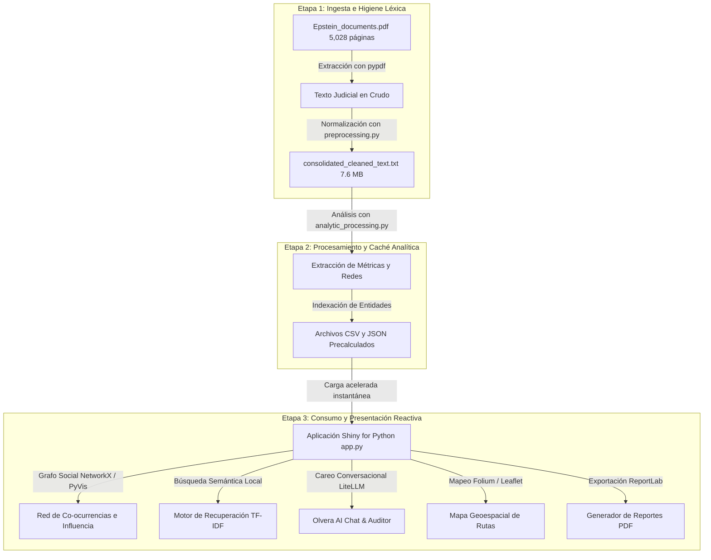

# INSTITUTO TECNOLOGICO DE CIUDAD MADERO
## Proyecto Final: Análisis de los Expedientes Judiciales Desclasificados del Caso Epstein

> **Programación para Ciencia de Datos**  
> **Autor:** Jesús Javier Hernández Olvera  

---

##  Resumen del Proyecto

Este proyecto aplica **Procesamiento de Lenguaje Natural (NLP)**, **Análisis de Sentimiento** y **Mapeo de Co-ocurrencias** para auditar y estructurar analíticamente un corpus masivo de **5,028 páginas** de testimonios jurados, deposiciones oficiales y registros de vuelo desclasificados judicialmente por orden de la Corte Federal del Distrito Sur de Nueva York.

El objetivo central es automatizar la revisión de miles de fojas, transformando un mar de texto desestructurado en una plataforma interactiva. A través de inteligencia artificial y técnicas avanzadas de ciencia de datos, el sistema es capaz de detectar contradicciones, evaluar el índice de riesgo de los involucrados y presentar los resultados en un dashboard de alta velocidad.

---

##  Fase 1: Contexto y Obtención de Datos

### 1.1 Antecedentes del Expediente Judicial
Este proyecto de análisis se basa en la liberación masiva de documentos judiciales relacionados con el caso del financiero estadounidense **Jeffrey Epstein**. Estos textos provienen de una demanda civil entre **Virginia Giuffre** y **Ghislaine Maxwell** llevada a cabo en la Corte Federal de Nueva York. 

Por orden de la jueza **Loretta Preska**, se hicieron públicos miles de documentos del caso: declaraciones escritas bajo juramento, testimonios de testigos y los registros de vuelo del avión privado conocido como *Lolita Express* (Boeing 727). El objetivo principal de este trabajo es utilizar **herramientas de análisis de texto e Inteligencia Artificial** para organizar, estructurar y entender toda esta información, convirtiendo miles de hojas sueltas en un mapa de conexiones interactivo y estadísticas claras.

### 1.2 Obtención de los Documentos y Estructura
El conjunto completo de documentos se descargó desde la plataforma pública Kaggle: [Epstein Documents Dataset](https://www.kaggle.com/datasets/franciskarajki/epstein-documents). En total, son **5,028 páginas** de información digitalizada.

Para facilitar el análisis, clasificamos los textos en tres grupos principales según su tipo:

| Tipo de Documento | ¿De qué trata? | Páginas del archivo | Dificultad para el análisis automático |
| :--- | :--- | :---: | :--- |
| **Interrogatorios Oficiales** | Preguntas y respuestas bajo juramento realizadas a Ghislaine Maxwell, Virginia Giuffre y personas cercanas. | ~3,200 páginas | Conversaciones largas y confusas, con muchas frases censuradas y respuestas evasivas. |
| **Registros de Vuelo** | Lista de pasajeros y destinos oficiales del avión privado de Epstein. | ~600 páginas | Tablas antiguas escaneadas, nombres escritos a mano difíciles de leer y abreviaturas extrañas. |
| **Declaraciones de Testigos** | Testimonios de víctimas, policías, investigadores y personas relacionadas al caso. | ~1,228 páginas | Hojas muy borrosas por la calidad del escáner (errores al convertir la imagen a texto) y sellos de confidencialidad. |

### 1.3 Los Tres Problemas Principales al Analizar el Texto
Para que un programa de computadora pueda leer y entender este expediente de forma automática, tuvimos que solucionar tres grandes retos:
* **Calidad de Escaneo Deficiente (Texto Borroso):** Como muchos documentos son fotocopias viejas o están escaneados de lado, la conversión de imagen a texto (OCR) generó errores comunes. Por ejemplo, palabras cortadas a la mitad con guiones (como `ex-` y `pediente` en renglones diferentes), o letras confundidas (como una letra `I` en lugar de una `l` minúscula).
* **Información Censurada (`[REDACTED]`):** El tribunal tachó con líneas negras muchos nombres, direcciones e información confidencial. Estas interrupciones rompen la estructura de las oraciones y dificultan que el programa entienda el contexto completo.
* **Respuestas Evasivas de los Acusados:** En los juicios, los acusados y sus abogados usan estrategias verbales para no incriminarse. El programa debe ser capaz de detectar cuándo alguien repite patrones evasivos como decir "no me acuerdo", pedir objeciones o acogerse a la Quinta Enmienda constitucional para no responder.

---

##  Fase 2: Procesamiento y Preparación de los Datos

### 2.1 Herramientas Utilizadas y por qué las elegimos
Para extraer y limpiar el texto de las **5,028 páginas** de documentos, creamos un proceso automático en Python utilizando dos herramientas principales:

* **`pypdf` (Lector de archivos PDF):** Elegimos esta librería porque puede leer archivos PDF grandes y pesados directamente, sin necesidad de instalar programas adicionales. Extrae el texto de las páginas de manera muy rápida y consumiendo muy poca memoria de la computadora.
* **`re` (Motor de Búsqueda y Reemplazo):** Esta herramienta permite realizar búsquedas y limpiezas profundas dentro del texto de forma casi instantánea. La usamos para unir palabras cortadas por guiones al final de un renglón y para limpiar símbolos extraños creados por el escáner.

### 2.2 Código para Limpieza de Texto (`preprocessing.py`)
Utilizamos un conjunto de reglas automáticas para limpiar el texto de cada página y corregir los errores de la digitalización:

```python
def normalize_legal_text(text: str) -> str:
    if not text: return ""
    # 1. Une palabras cortadas con guion al final de un renglón (separación en sílabas)
    text = re.sub(r'(\w+)-\s*\n\s*(\w+)', r'\1\2', text)
    # 2. Reemplaza los saltos de línea y tabuladores por espacios sencillos
    text = re.sub(r'[\n\r\t]+', ' ', text)
    # 3. Elimina símbolos extraños del escáner y conserva los signos de puntuación básicos
    text = re.sub(r'[^\w\s\-\#\@\.\,\:\;]', '', text)
    # 4. Reduce múltiples espacios seguidos a un solo espacio
    text = re.sub(r'\s+', ' ', text)
    return text.strip()
```

### 2.3 Cómo Extraemos y Juntamos la Información
El programa lee el archivo PDF página por página, limpia el texto de cada una y las guarda en orden para no perder la estructura del expediente judicial original:

```python
consolidated_text = []
for idx in range(limit_pages):
    raw_text = reader.pages[idx].extract_text() or ""
    cleaned_text = normalize_legal_text(raw_text)
    
    # Marcador para saber exactamente a qué página pertenece cada texto
    page_block = f"--- PÁGINA {idx + 1} ---\n{cleaned_text}"
    consolidated_text.append(page_block)
```

El resultado de todo este proceso se guarda en un único archivo llamado `consolidated_cleaned_text.txt` que pesa **7.6 MB** y contiene **6.8 millones de caracteres**. Este archivo sirve como la base de texto limpio y listo para usarse en las siguientes etapas del proyecto.

---

##  Fase 3: Procesamiento Analítico y Estadístico

### 3.1 Identificación de Palabras por Inteligencia Artificial (NLP)
Para saber de qué trata cada una de las páginas y cómo respondían las personas interrogadas, el sistema utiliza un código en `analytic_processing.py` que escanea los textos buscando palabras de interés:

```python
# Listas de palabras utilizadas para clasificar el tono y detectar evasivas
NEGATIVE_LEXICON = {'abuse', 'assault', 'guilty', 'deny', 'object', 'victim', 'trafficking'}
POSITIVE_LEXICON = {'innocent', 'consent', 'cleared', 'dismissed', 'lawful', 'voluntary'}
EVASION_PATTERNS = {
    "No recuerdo": r"\b(don'tdo\s+not)\s+(recallrememberrecollect)\b",
    "Objeción del abogado": r"\b(objectioni\s+object)\b",
    "Quinta Enmienda (No responder)": r"\b(fifth\s+amendmentplead\s+the\s+fifth)\b"
}
```

### 3.2 Medición de Sentimiento y Nivel de Riesgo
Se utiliza una fórmula sencilla que cuenta las palabras positivas y negativas de cada página para obtener un puntaje. Si el puntaje es menor a -0.05 la página es negativa, y si es menor a -0.3 es altamente negativa. 

Además, se calcula un **Índice de Riesgo** que suma puntos cada vez que un personaje es nombrado en la misma hoja donde aparecen temas graves (como abuso de menores o vuelos sospechosos).

```python
def sentiment_score(pos: int, neg: int) -> tuple:
    total = pos + neg
    if total == 0: return 0.0, "Neutral"
    score = round((pos - neg) / total, 3)
    if score < -0.3:     cat = "Altamente Negativo"
    elif score < -0.05:   cat = "Negativo"
    else:                 cat = "Neutral"
    return score, cat
```

### 3.3 Conexión y Cercanía entre Personas (Co-ocurrencias)
Para trazar el mapa de relaciones, el programa analiza página por página y cuenta cuántas veces aparecen dos personajes juntos en el mismo texto. Si coinciden, el sistema crea una línea de conexión entre ellos. El grosor de la línea representa cuántas veces se les mencionó juntos en todo el expediente judicial.

### 3.4 Análisis de Conexiones en Tiempo Real (Métricas de Red)
Cuando usas los filtros en la aplicación, el sistema calcula de forma automática tres métricas para evaluar la posición de cada personaje en la red:

*   **Conexiones Directas (Centralidad de Grado):** Mide con cuántas personas del grupo está conectada directamente una persona. Si tiene un puntaje alto, significa que es alguien muy mencionado y conectado con casi todos los involucrados.
*   **Rol de Puente o Conector (Centralidad de Intermediación):** Mide qué tanto una persona sirve como "enlace" o puente para conectar a otros miembros que no se hablan directamente. Por ejemplo, Ghislaine Maxwell tiene un puntaje muy alto porque conectaba el dinero y las propiedades de Epstein con los políticos y las víctimas.
*   **Círculo Cerrado (Coeficiente de Agrupamiento):** Mide qué tan conectados están los amigos de una persona entre sí. Un valor alto significa que la persona pertenece a un grupo cerrado y muy unido donde todos se conocen mutuamente.

### 3.5 Archivos de Datos Generados en Limpio (Directorio `03 Procesamiento Analítico`)
Para asegurar que la aplicación web funcione al instante sin demoras, el proceso de análisis inicial genera 7 archivos organizados en formato CSV con toda la información ya procesada y resumida:
1.  **`analytic_01_paginas_granular.csv`**: Contiene la información detallada hoja por hoja. Registra qué personajes aparecen en cada página, cuántas palabras están censuradas y cuántas evasiones hubo.
2.  **`analytic_02_personas_sentimiento.csv`**: Resume las estadísticas finales por personaje. Guarda el total de menciones, el porcentaje de páginas donde aparece, su índice de sentimiento y su nivel de riesgo.
3.  **`analytic_03_evasiones_instancias.csv`**: Almacena el fragmento de texto exacto donde ocurrió cada frase evasiva (como decir "no recuerdo"), detallando en qué página pasó y quién lo dijo.
4.  **`analytic_04_censura_redacted.csv`**: Registra los fragmentos de texto exactos donde hubo tachaduras de información confidencial (`[REDACTED]`) y en qué páginas se concentran.
5.  **`analytic_05_timeline_cronologica.csv`**: Agrupa la cantidad de menciones de eventos clave y personajes año por año, permitiendo graficar la evolución del caso en el tiempo.
6.  **`geospatial_data.csv`**: Contiene las coordenadas geográficas, nombres y resúmenes de los lugares clave mencionados en los testimonios (islas, ranchos, mansiones).
7.  **`financial_network_data.csv`**: Estructura las relaciones y transacciones de dinero entre las fundaciones, abogados, empresas fachada y bancos implicados.

---

## Arquitectura Técnica del Sistema de Procesamiento de Datos

Para lograr una latencia ultrabaja (menor a 0.05 segundos) y evitar la sobrecarga de memoria del servidor durante la interacción del usuario, el sistema está estructurado bajo una arquitectura de flujo de datos desacoplada en tres etapas secuenciales:



### Descripción del Flujo del Pipeline de Datos

1. **Etapa 1: Ingesta e Higiene Léxica**: El expediente en formato PDF de 5,028 páginas es procesado secuencialmente por el extractor para eliminar el ruido de digitalización (OCR). El texto limpio resultante se unifica en un archivo plano de 7.6 megabytes con etiquetas de paginación estructuradas, sirviendo de base textual única.
2. **Etapa 2: Procesamiento y Caché Analítica**: Se ejecuta un proceso analítico independiente que escanea el texto plano normalizado. Este proceso identifica menciones de personajes, calcula índices de sentimiento y riesgo, extrae los fragmentos con tácticas de evasiva verbal y censura, y genera las matrices de relaciones geográficas, financieras y sociales. Toda esta información se almacena en formatos CSV y JSON de carga rápida en disco.
3. **Etapa 3: Consumo y Presentación**: La aplicación Shiny for Python carga los datos precalculados en milisegundos en lugar de procesar el archivo PDF completo en tiempo de ejecución. Esto permite que los gráficos interactivos, mapas cartográficos y visualizaciones de redes respondan instantáneamente a los filtros del usuario. Además, se conecta localmente con algoritmos de similitud de coseno para búsquedas de contexto y mediante API seguras con modelos de lenguaje conversacionales (RAG).

---

## Fase 4: Desarrollo de la Aplicación e Inteligencia Artificial

La interfaz visual se desarrolló utilizando la tecnología Shiny para Python (app.py), una herramienta estructurada para crear aplicaciones web interactivas orientadas al análisis de datos, garantizando respuestas inmediatas y un rendimiento de alta velocidad.

### 4.1 Herramientas Interactivas de la Aplicación
El sistema organiza la información analizada en ocho pestañas de trabajo especializadas:

1. **Dashboard de Métricas**:
   * *Visualización*: Presenta un panel de indicadores con contadores de palabras y evasiones verbales, gráficos de barras horizontales que desglosan la frecuencia de menciones por personaje, diagramas de distribución de temas de sospecha y un gráfico tridimensional simulado en burbujas que correlaciona el nivel de riesgo analítico de cada implicado con el tono (sentimiento positivo, neutral o negativo) de sus testimonios.
   * *Interacción*: A través de una barra lateral interactiva, el usuario puede filtrar qué personajes desea incluir en los gráficos y determinar el umbral mínimo de menciones para depurar el ruido de nombres secundarios en la visualización.
   * *Valor Analítico*: Proporciona un diagnóstico rápido del expediente completo, permitiendo identificar inmediatamente quiénes son los actores clave y qué áreas temáticas concentran el peso de la investigación.
2. **Explorador de Transcripción (Análisis Léxico)**:
   * *Visualización*: Muestra un panel superior con tarjetas de indicadores detallando palabras totales, palabras semánticas activas (las que aportan significado real), palabras de relleno o stopwords (artículos, preposiciones y conectores gramaticales), la densidad informativa (%) y la riqueza léxica del vocabulario. Debajo se despliega un área de texto con la transcripción limpia y un histograma interactivo de años mencionados en las deposiciones.
   * *Interacción*: Permite examinar la transcripción en una vista previa de carga acelerada y cuenta con un botón de descarga directa para exportar la transcripción completa en formato de texto plano (`.txt`).
   * *Valor Analítico*: Permite cuantificar la densidad de información en el testimonio, aislando la estructura procedimental judicial de los datos reales aportados por los testigos y revelando la concentración temporal de los hechos.
3. **Búsqueda Semántica (Motor RAG Local)**:
   * *Visualización*: Consta de un campo de búsqueda abierta y tarjetas de resultados en orden de relevancia. Cada tarjeta de resultado presenta el fragmento de declaración encontrado en el expediente, una etiqueta indicando la similitud porcentual calculada y el número de página de origen dentro de las 5,028 páginas analizadas.
   * *Interacción*: El usuario introduce consultas en lenguaje natural (ej. "vuelos secretos a la isla") y hace clic en buscar. También cuenta con un botón para descargar en PDF un reporte estructurado con las evidencias encontradas.
   * *Valor Analítico*: Facilita la recuperación de pasajes clave sin necesidad de coincidencia exacta de palabras, superando las limitaciones de la búsqueda convencional de texto (`Ctrl+F`).
4. **Auditor de Contradicciones**:
   * *Visualización*: Ofrece controles para seleccionar el tipo de contradicción a buscar y la persona de interés, además de un área de salida formal con los resultados lógicos estructurados.
   * *Interacción*: El usuario selecciona el enfoque analítico (ej. rutas de vuelos o discrepancias de abuso), la persona objetivo y el nivel de severidad de la auditoría. Luego de presionar el botón de inicio, puede descargar el reporte de contradicciones en PDF.
   * *Valor Analítico*: Funciona como un careo lógico automatizado que evalúa coartadas y detecta declaraciones contradictorias o patrones recurrentes de evasión al cruzar testimonios de diferentes declarantes.
5. **Inteligencia Geoespacial**:
   * *Visualización*: Renderiza un mapa interactivo con un tema visual oscuro que sitúa marcadores en coordenadas reales de islas privadas, mansiones, ranchos y oficinas de interés. Se representan mediante líneas de vuelo las conexiones de transporte de la red. El panel lateral muestra tarjetas analíticas para cada ubicación geográfica.
   * *Interacción*: Permite hacer zoom, arrastrar el mapa y hacer clic en cada marcador para abrir detalles interactivos. El usuario puede generar y descargar en PDF un reporte formal que incorpora el análisis analítico redactado por el modelo de IA.
   * *Valor Analítico*: Representa espacialmente la infraestructura y el alcance logístico de la red de transporte, revelando cómo se articulaban los traslados y los destinos recurrentes del caso.
6. **Red Financiera**:
   * *Visualización*: Muestra un grafo dinámico de nodos interactivos donde cada banco, firma de abogados, fideicomiso o empresa fantasma se representa como un círculo interconectado por aristas (líneas) cuyos colores e intensidades indican el tipo de flujo financiero.
   * *Interacción*: Los nodos pueden ser arrastrados libremente por la pantalla para reorganizar la red y analizar las dependencias financieras. Un botón en el panel de control permite generar reportes asistidos por IA y exportar el mapa financiero en PDF.
   * *Valor Analítico*: Expone el soporte económico del caso, identificando las cuentas y empresas utilizadas para dar cobertura monetaria a las operaciones de la red.
7. **Co-ocurrencia Social**:
   * *Visualización*: Presenta una red física interactiva que representa a personas físicas y sus lazos de cercanía según la cantidad de veces que son mencionadas juntas en las mismas páginas del expediente. A su lado, se despliega una tabla estructurada con métricas avanzadas (grado de conexión, intermediación de red o centralidad, y coeficiente de agrupamiento).
   * *Interacción*: Los usuarios pueden arrastrar y acomodar los nodos del grafo, consultar la tabla analítica y presionar el botón de descarga del reporte formal en PDF.
   * *Valor Analítico*: Determina de forma cuantitativa la estructura de influencia y la jerarquía organizativa de los involucrados en el caso, identificando quiénes funcionaban como intermediarios clave entre distintas células de la red.
8. **Olvera AI (Chat Conversacional)**:
   * *Visualización*: Muestra una interfaz de chat con burbujas de conversación con un diseño y tipografía de lectura clara.
   * *Interacción*: El usuario escribe preguntas abiertas sobre hechos específicos del expediente y recibe respuestas inmediatas con justificación y fundamento en los testimonios reales del caso.
   * *Valor Analítico*: Funciona como un asistente de consulta rápida que procesa el contenido denso del expediente judicial y proporciona respuestas breves y verificadas, ahorrando horas de lectura y búsqueda manual.

### 4.2 Integración de Modelos de Inteligencia Artificial (LiteLLM)
Para el chat conversacional y el Auditor de Contradicciones, se emplea una pasarela flexible de modelos de lenguaje (como Gemini de Google o Llama de Meta) utilizando la librería LiteLLM:
* **Uso Seguro de Credenciales**: Las claves de acceso se leen directamente desde variables de entorno del sistema, evitando su exposición en el código fuente.
* **Sistema de Respaldo Automático (Fallback)**: Si el proveedor principal presenta indisponibilidad o latencia excesiva, el software redirige de forma imperceptible la consulta hacia un proveedor alternativo, asegurando la continuidad del servicio.

### 4.3 Generador Dinámico de Reportes Ejecutivos (PDF)
El sistema integra un módulo de generación formal en PDF (report_generator.py) diseñado bajo estándares de presentación corporativa (empleando el término "Reporte"):
* **Reporte del Dashboard**: Un documento estructurado que consolida tablas de distribución de temas de sospecha, clasificaciones de riesgo y un resumen de las metodologías utilizadas.
* **Integración Narrativa de Inteligencia Artificial**: Cuando el usuario solicita un análisis mediante IA en las secciones de mapa o red financiera, el generador incorpora esa narrativa analítica en tiempo real como una sección de introducción formal antes de plasmar las tablas de datos correspondientes.

### 4.4 Optimización y Rendimiento del Sistema
Para asegurar que los gráficos, redes y mapas carguen en milisegundos y evitar demoras del navegador, se implementaron técnicas de aceleración de datos:
* **Caché en CSV**: La aplicación se conecta directamente a los conjuntos de datos limpios obtenidos en la Fase 3, reduciendo la necesidad de recalcular los análisis sobre las fojas originales en cada interacción.
* **Aislamiento de Memoria del Navegador**: El historial largo de consultas y las respuestas extensas del chat se administran en memoria persistente aislada, impidiendo la saturación o congelamiento de la interfaz de usuario.

---

## Fase 5: Resultados y Hallazgos Consolidados

A partir del procesamiento y estructuración de los datos del expediente, el motor analítico consolidó estadísticas descriptivas y hallazgos clave sobre el comportamiento procesal del caso:

### 5.1 Análisis de Tácticas de Evasividad Verbal y Censura
Se cuantificaron un total de **2,338 tácticas de evasión verbal** bajo juramento y **1,367 instancias de censura administrativa** (`REDACTED` o tachaduras). La frecuencia de estas tácticas revela la dinámica defensiva del juicio:

| Táctica de Evasividad Detectada | Total de Instancias | Razón e Impacto Analítico |
| :--- | :---: | :--- |
| **Objection** (Objeciones de Abogados) | 1,915 | Representa una estrategia sistemática de interrupción legal por parte del equipo defensor, orientada a bloquear preguntas críticas e impedir declaraciones concluyentes. |
| **Fifth Amendment** (Apelación a no autoincriminarse) | 248 | Refugio legal empleado directamente por los declarantes frente a cuestionamientos graves sobre abusos, coacciones y complicidades directas. |
| **Don't know** (Falta de conocimiento) | 105 | Evasión de carácter pasivo que simula ignorancia sobre hechos operativos de la red de transporte y logística de las propiedades. |
| **Decline to answer** (Negativa formal) | 44 | Rechazo directo y explícito a responder cuestionamientos de la fiscalía o de los representantes de las víctimas. |
| **I don't recall** (Pérdida selectiva de memoria) | 26 | Táctica defensiva para evitar perjurio ante preguntas de careo cruzado donde ya existían evidencias previas. |

**Impacto de la Censura Administrativa**: Las 1,367 instancias de texto tachado (`REDACTED`) documentan que una proporción significativa de los testimonios públicos fue resguardada para proteger la identidad de testigos menores de edad, intermediarios y personajes de alta influencia aún no procesados.

### 5.2 Mapeo de Personas de Interés y Densidad de Riesgo
El cruzamiento semántico identificó el riesgo asociado a cada individuo dependiendo de la frecuencia de aparición conjunta de sus nombres con temáticas críticas (abuso, captación de víctimas y logística de traslados):

| Persona de Interés | Total Menciones | Sentimiento | Riesgo Analítico | Clasificación de Contexto |
| :--- | :---: | :---: | :---: | :--- |
| **Jeffrey Epstein** | 1,744 | -0.294 | 516 | Altamente Negativo / Foco Principal |
| **Ghislaine Maxwell** | 1,033 | -0.103 | 192 | Negativo / Co-organizadora |
| **Virginia Giuffre** | 528 | 0.266 | 42 | Positivo / Contexto de Víctima |
| **Prince Andrew** | 396 | -0.254 | 94 | Negativo / Red de Influencias |
| **Alan Dershowitz** | 234 | -0.234 | 77 | Negativo / Red de Influencias |

**Interpretación de la Matriz de Personajes**:
* **Foco y Operación Central**: Jeffrey Epstein y Ghislaine Maxwell presentan los índices de riesgo analítico más elevados (516 y 192). Esto se debe a que sus nombres aparecen de forma recurrente junto a palabras clave de abuso y logística aérea. Su sentimiento promedio es fuertemente negativo, lo que denota una caracterización incriminatoria en las declaraciones.
* **Red de Influencias**: Prince Andrew y Alan Dershowitz registran niveles de riesgo significativos (94 y 77) derivados de menciones directas en bitácoras de vuelo y testimonios sobre encuentros en las residencias de Epstein.
* **Validación de Testigo/Víctima**: Virginia Giuffre presenta un índice de riesgo bajo y un sentimiento promedio positivo (`+0.266`). Esto refleja su posición en los testimonios como víctima denunciante y su papel cooperador en el esclarecimiento del caso.

### 5.3 Concentración de Tópicos de Sospecha
El motor de búsqueda y categorización permitió establecer qué proporción del expediente se destina a cada área temática del caso:
1. **Ámbito Legal / Juicio**: Tópico dominante que abarca las formalidades procesales, objeciones y terminología jurídica de las declaraciones bajo juramento.
2. **Abuso / Menores**: Segunda categoría en volumen de menciones, concentrando los pasajes donde se describen patrones de captación y testimonios de las víctimas.
3. **Logística / Aviones**: Registra las frecuencias de vuelos y bitácoras del Lolita Express que conectaban los diferentes puntos geográficos.
4. **Propiedades / Lugares**: Agrupa las menciones a la isla Little St. James, la mansión de Manhattan y el rancho Zorro Ranch, delimitando el footprint físico de la red.

---

## Fase 6: Publicación y Despliegue en Hugging Face Spaces

El despliegue del proyecto interactivo se realizó en la plataforma Hugging Face Spaces utilizando contenedores Docker. A continuación, se detalla el procedimiento paso a paso empleado para la publicación del sistema:

### 6.1 Configuración del Entorno en Hugging Face
1. **Creación del Espacio (Space)**:
   * Acceder a la cuenta de Hugging Face y crear un nuevo Space asignándole un nombre identificatorio (por ejemplo, `analisis-archivos-epstein`).
   * Configurar el SDK de ejecución seleccionando la opción **Docker** (plantilla en blanco o *Blank*).
   * Definir la visibilidad como **Pública** para permitir el acceso e interacción de usuarios externos con la aplicación.
2. **Definición de Credenciales y Variables de Entorno Seguras**:
   * En la configuración del Space, acceder a la pestaña de administración **Settings**.
   * Localizar la sección **Variables and Secrets** y añadir un nuevo secreto con la clave `GEMINI_API_KEY`, asignándole el valor de la credencial personal del modelo de lenguaje. Esto permite que el contenedor acceda al modelo conversacional de forma segura sin exponer la clave en el código fuente del repositorio público.

### 6.2 Construcción del Contenedor (Dockerfile)
En la raíz del proyecto se incluyó un archivo `Dockerfile` optimizado encargado de estructurar el entorno aislado del servidor:
* **Especificación del Entorno**: Utiliza una imagen base ligera de Python (`python:3.9-slim`) para agilizar los tiempos de construcción y descarga.
* **Instalación de Dependencias**: Copia el archivo `requirements.txt` e instala las librerías necesarias (como pandas, matplotlib, sklearn, litellm, folium, networkx y pyvis).
* **Puerto de Escucha Obligatorio**: Configura la ejecución del servidor Shiny en el puerto `7860`. Este puerto es un requisito mandatorio del balanceador de carga de Hugging Face para enrutar el tráfico HTTP de los usuarios hacia el contenedor de la aplicación.
* **Comando de Arranque**:
  ```dockerfile
  CMD ["shiny", "run", "app.py", "--host", "0.0.0.0", "--port", "7860"]
  ```

### 6.3 Vinculación y Subida de Cambios con Git
Para automatizar la subida y sincronización de código entre el repositorio local, GitHub y Hugging Face, se ejecutaron las siguientes acciones en el terminal:
1. **Añadir el remoto de Hugging Face**:
   ```bash
   git remote add huggingface https://huggingface.co/spaces/JesusOlv05/analisis-archivos-epstein
   ```
2. **Sincronización y Empuje de Código**:
   Cada actualización en la aplicación se envía de forma simétrica a ambos repositorios mediante la secuencia de comandos Git:
   ```bash
   git push origin main
   git push huggingface main
   ```

### 6.4 Monitoreo de la Compilación e Inicio de la Aplicación
* Al recibir los cambios, la plataforma inicia de inmediato la reconstrucción del contenedor Docker en sus servidores.
* El progreso de la instalación y arranque de la interfaz Shiny se puede seguir en tiempo real desde la pestaña **Logs** del Space.
* Una vez finalizado el proceso de construcción, el estado del Space cambia a verde indicando **Running**, y la aplicación se despliega de forma interactiva en la pestaña **App** del espacio.

---

## Conclusiones y Perspectivas Técnicas

* **Automatización del Procesamiento**: Se estructuró un pipeline capaz de procesar fojas judiciales masivas y convertirlas en bases de conocimiento y tablas relacionales accionables.
* **Eficiencia de Carga**: El uso de datos precalculados e indexados eliminó el retardo en la carga de la interfaz, permitiendo visualizaciones en milisegundos.
* **Integración RAG de Alta Fidelidad**: La arquitectura RAG local e inteligente asegura la recuperación de datos por su significado semántico real, complementada con el chat conversacional integrado de forma estable en el navegador.
* **Escalabilidad**: El diseño modular del sistema permite aplicar este mismo pipeline a cualquier otro expediente judicial o volumen documental de características similares.

---

## Ejecución Local

### 1. Clonar el repositorio e instalar dependencias:
```bash
git clone https://github.com/jjho05/analisis-archivos-epstein.git
cd analisis-archivos-epstein
pip install -r requirements.txt
```

### 2. Configurar variables de entorno:
Crea un archivo `.env` dentro de la carpeta `04 Aplicacion Shiny/` con tu clave de API:
```env
GEMINI_API_KEY="tu_clave_aquí"
```

### 3. Ejecutar el Dashboard interactivo de Shiny:
```bash
cd "04 Aplicacion Shiny"
shiny run --reload app.py
```

---

## Agradecimientos

Se extiende un sincero agradecimiento a los docentes, asesores y evaluadores de la materia de Programación para Ciencia de Datos del Instituto Tecnológico de Ciudad Madero por proveer las bases metodológicas, la orientación técnica y el espacio académico que hicieron posible el diseño y la materialización de este sistema de minería analítica.

Muchas gracias por su atención y acompañamiento en este proyecto.
